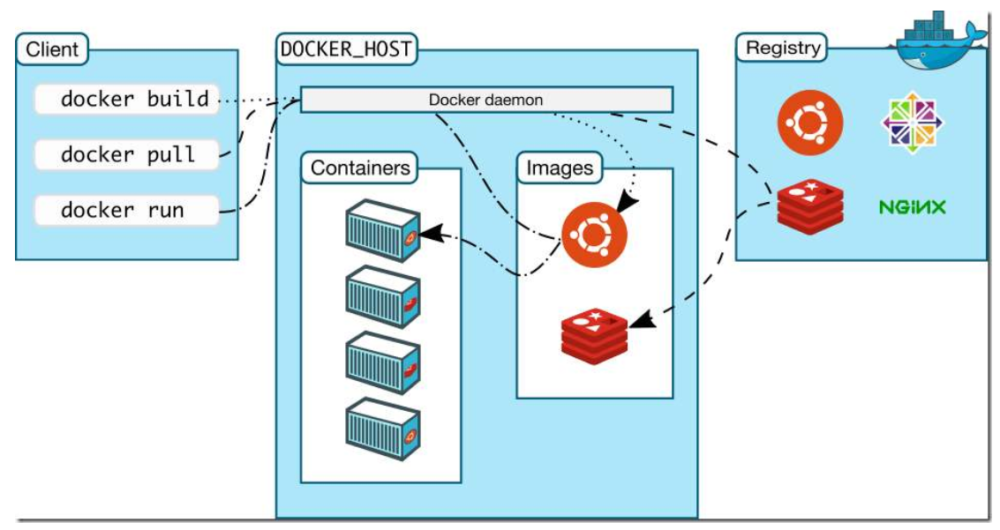

[总结自：【狂神说Java】Docker最新超详细版教程通俗易懂](https://www.bilibili.com/video/BV1og4y1q7M4)

# Docker 概述

## Docker 出现的背景

发布产品时，每台机器都要部署环境，费时费力。因此开发人员来开发项目，专门的运维人员来进行环境的配置和项目部署（DevOps）。

但Docker 允许让`项目和环境`打包发布，省去环境部署的麻烦。


## Docker 历史

2010 年，几个搞IT的年轻人，在美国成立了一家公司``dotCloud`，做pass的云计算服务！LXC 有关的容器技术！他们将自己的技术（容器化技术）命名为Docker。Docker刚诞生，没有引起行业的注意。于是dotCloud活不下去了！

2013年`开源` => 火了，很多人发现了Docker 的优点！几乎每个月都会更新一个版本。

2014年4月，`Docker 1.0` 发布。


> 聊聊Docker

Docker 是基于Go语言开发的开源项目。

官网：[https://www.docker.com/](https://www.docker.com/)

文档地址：[https://docs.docker.com/](https://docs.docker.com/)

仓库地址：[https://hub.docker.com/](https://hub.docker.com/)


## Docker 能干嘛

> 之前的虚拟机技术


**虚拟机技术的缺点：**

1. 资源占用十分多
2. 冗余步骤多
3. 启动很慢

> 容器化技术

**容器化技术不是模拟一整个完整的操作系统**


**比较Docker和虚拟机技术的不同**

- 传统虚拟机，虚拟出一套硬件，运行一个完整的操作系统，然后在这个操作系统上安装和运行软件。
- 容器内的应用直接运行在虚拟机的内核，容器是没有自己的内核的，也没有虚拟硬件，因此轻便。
- 每个容器间互相隔离，每个容器都有一个属于自己的文件系统，互不影响。

> DevOps （开发、运维）

1. 更快速的交付和部署（Docker：打包镜像发布测试，一键运行）
2. 更快捷的升级和扩缩容（部署应用就像搭积木，升级只需要更换镜像）
3. 更简单的系统运维（不会存在环境不一致问题）
4. 更高效的计算机资源利用（Docker是内核级的虚拟化，可以在一个物理机上运行很多的容器实例）


# Docker 安装

## Docker 基本组成



**镜像（image）**

Docker 镜像就好比一个模板，可以通过这个模板来创建容器服务。

**容器（container）**
Docker 利用容器技术，独立运行一个或者一个组应用。

启动，停止，删除等基本命令！（简单不恰当理解：简易的Linux系统）

**仓库（repository）**

仓库就是存放镜像的地方（Docker Hub）！


## 安装 Docker

## 测试 hello-world

> docker run hello-world
>
> docker images

## 回顾hello-world流程


## 底层原理

**Docker 是怎么工作的？**

Docker 是一个Client-Server架构的系统，Docker的守护进程运行在主机上，通过Socket从客户端访问！

Docker-Server接收到Docker-Client的指令，就会执行这个命令！


**Docker 为什么比 VM 快？**

1. Docker 有着比虚拟机更少的抽象层
2. Docker 利用的是宿主主机的内核，vm 需要的是 Guest OS.


所以说，新建一个容器的时候， Docker不需要像虚拟机一样重新加载一个操作系统内核。虚拟机时加载Guest OS，分终级别！。而Docker是利用宿主机的操作系统，省略这个复杂的过程，秒级！

# Docker 常用命令

## 帮助命令

```shell
docker version		# 显示docker的版本信息
docker info			# 显示docker的系统信息，包括镜像和容器的数量
docker 命令 --help   # 万能命令
```

帮助文档地址：[https://docs.docker.com/reference/](https://docs.docker.com/reference/)


## 镜像命令

**docker images 查看本地主机上所有镜像**

```shell
docker images -aq		# 查看所有镜像，只显示id
```

**docker search 搜索**

```shell
docker search mysql --filters=STARS=3000	# 过滤，查看stars>3000
```

**docker pull 下载镜像**

```shell
docker pull mysql		# 默认下载 lastest版本，也可指定版本下载
```

**docker rmi 删除**

```shell
docker rmi -f 容器id			# 删除指定的容器
docker rmi -f $(docker images -aq) 	# 删除全部容器
```


## 容器命令

**新建容器并启动**

```shell
docker run [可选参数] image

# 参数说明
--name = "Name"		容器的名字
-d					后台运行
-it					使用交互方式运行
-p					指定容器的端口
	-p ip:主机端口:容器端口
	-p 主机端口:容器端口(常用)
	-p 容器端口
	容器端口
-P					随机指定端口
```

**列出所有的运行的容器**

```shell
docker ps
			# 列出当前正在运行的容器
-a			# 列出当前正在运行的容器+历史运行过的容器
-n=?		# 显示最近创建的容器
-q			# 只显示容器的编号
```

**退出容器**

```shell 
exit	# 直接容器停止并退出
Ctrl + p + q  # 容器不停止退出
```

**删除容器**

```shell
docker rm 容器id					# 删除指定容器，不能删除正在运行的容器，如果要强制删除 rm -f
docker rm -f $(docker ps -aq)	 # 删除所有容器
docker ps -aq | xargs docker rm	 # 删除所有容器
```

**启动和停止容器的操作**

```shell
docker start 容器id		# 启动
docker restart 容器id		# 重启
docker stop 容器id		# 停止
docker kill 容器id		# 杀掉
```

## 常用其它命令

**后台启动容器**

```shell
docker run -d centos
# docker ps 发现centos停止了

# 常见的坑：docker 容器使用后台方式运行，就必须要有一个前台进程，docker发现没有应用就会自动停止。
```

**查看日志**

```shell
docker logs -f -t --tail 容器

# 自己写一段shell脚本
docker run -d centos /bin/bash -c "while true;do echo hero;sleep 1;done"

# 显示日志
docker logs -tf --tail 10 容器id
```

**查看容器中的进程信息**

```shell
docker top 容器id
```

**查看镜像的元数据**

```shell
docker inspect 容器id
```

**进入当前正在运行的容器**

```shell
# 场景：通常容器都是使用后台方式运行，假设需要进入容器，修改一些配置

# 命令
docker exec -it 容器id bashShell
# 方式二
docker attach 容器id

# docker exec 	进入容器后开启一个新的终端（常用）
# docker attach 进入容器正在执行的终端， 不会启动新的进程
```

**从容器内拷贝文件到容器外**

```shell
docker cp 容器id:容器内路径 目标主机路径  # 只要容器存在即可，无需运行
```

## 小结


